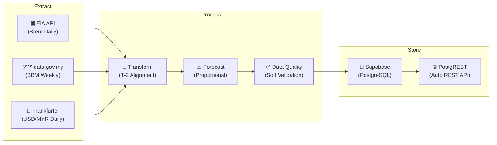

# 🛢️ Spoily Data — Fuel Price Predictor Pipeline

Automated ETL pipeline that tracks and correlates **global Brent Crude prices** with **Malaysian retail fuel prices** (RON97 & RON95), then predicts next week's fuel price using a proportional projection model.

## Architecture



## How It Works

| Concept | Detail |
|:--------|:-------|
| **Pricing Cycle** | Malaysia sets fuel prices weekly (Thu → Wed) |
| **T-2 Lag** | BBM price this week is influenced by Brent price ~2 weeks prior |
| **Prediction** | If Brent moved X% from T-2 to T-1, project same % change to BBM |
| **Schedule** | Pipeline runs every Thursday 8 AM MYT via cron / GitHub Actions |

## Data Sources

| Source | What | Auth |
|:-------|:-----|:-----|
| [EIA API v2](https://www.eia.gov/opendata/) | Brent crude daily spot price | API key (free) |
| [data.gov.my](https://data.gov.my/data-catalogue/fuelprice) | RON95, RON97, diesel weekly prices | None |
| [Frankfurter API](https://frankfurter.dev/) | USD/MYR daily exchange rate | None |

## Quick Start

### Prerequisites
- Python 3.10+
- [EIA API key](https://www.eia.gov/opendata/register.php) (free)
- [Supabase project](https://supabase.com) (free tier)

### Setup

```bash
# 1. Clone & setup
git clone <repo-url> && cd spoily-data
python -m venv .venv
.venv\Scripts\activate          # Windows
# source .venv/bin/activate     # Linux/Mac

pip install -r requirements.txt

# 2. Configure environment
copy .env.example .env
# Edit .env with your keys

# 3. Initialize database
# Go to Supabase SQL Editor → paste & run src/sql/init.sql

# 4. Run pipeline
python -m src.pipeline
```

### Using Make

```bash
make setup      # Create venv + install deps
make run        # Run full pipeline
make test       # Run tests
make keepalive  # Ping Supabase to prevent pausing
```

## Project Structure

```
spoily-data/
├── src/
│   ├── config/
│   │   └── settings.py          # Env vars + constants
│   ├── extract/
│   │   ├── brent_crude.py       # EIA API extractor
│   │   ├── malaysia_fuel.py     # data.gov.my extractor
│   │   └── exchange_rate.py     # Frankfurter API extractor
│   ├── transform/
│   │   └── processor.py         # T-2 alignment + merge
│   ├── forecast/
│   │   └── estimator.py         # Price prediction (Step 1)
│   ├── quality/
│   │   └── checks.py            # Data validation
│   ├── load/
│   │   └── database.py          # Supabase upsert
│   ├── sql/
│   │   └── init.sql             # DDL schema
│   └── pipeline.py              # Orchestrator
├── .github/workflows/
│   └── pipeline.yml             # Scheduled CI/CD
├── .env.example                 # Env template
├── Makefile                     # Common commands
└── requirements.txt             # Dependencies
```

## Database Schema

Single fact table: `fact_weekly_fuel_pricing`

| Column | Type | Description |
|:-------|:-----|:------------|
| `pricing_week_start` | DATE (PK) | Thursday effective date |
| `pricing_week_end` | DATE | Wednesday end date |
| `ron97_price_myr` | DECIMAL | RON97 retail price (MYR) |
| `ron95_price_myr` | DECIMAL | RON95 non-subsidized price (MYR) |
| `ron95_subsidy_myr` | DECIMAL | RON95 BUDI 95 subsidized price |
| `avg_brent_t2_usd` | DECIMAL | Avg Brent crude 2 weeks prior (USD) |
| `avg_usd_myr_t2` | DECIMAL | Avg exchange rate 2 weeks prior |
| `predicted_ron97_myr` | DECIMAL | Predicted RON97 price |
| `predicted_ron95_myr` | DECIMAL | Predicted RON95 price |
| `prediction_delta_pct` | DECIMAL | Prediction error % |

## REST API (Auto)

Supabase auto-generates a PostgREST API:

```bash
# Get all data
curl "https://<project>.supabase.co/rest/v1/fact_weekly_fuel_pricing" \
  -H "apikey: <anon-key>"

# Get latest week
curl "https://<project>.supabase.co/rest/v1/fact_weekly_fuel_pricing?order=pricing_week_start.desc&limit=1" \
  -H "apikey: <anon-key>"
```

## License

GPL-3.0