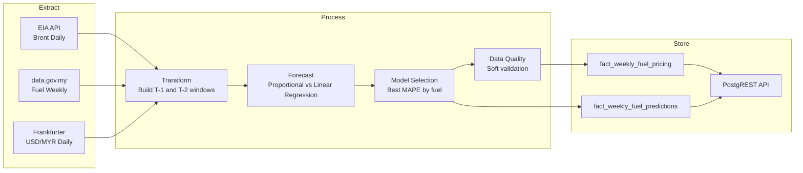

# 🛢️ Spoily Data — Malaysia Fuel Price Prediction Pipeline

Automated ETL pipeline that tracks **Brent crude** and **USD/MYR exchange rate** against **Malaysian retail fuel prices** (RON95 non-subsidized and RON97), then stores historical predictions for model evaluation and dashboard use.

## What It Does

- Extracts:
  - Brent daily prices (EIA API)
  - Malaysia weekly fuel prices (data.gov.my)
  - USD/MYR daily rates (Frankfurter)
- Builds weekly features with both lag windows:
  - `T-1` (1 week prior)
  - `T-2` (2 weeks prior)
- Benchmarks methodologies using walk-forward backtesting:
  - `proportional`
  - `linear_regression`
- Auto-selects the best methodology per fuel type (lowest MAPE).
- Persists:
  - weekly fact table (`fact_weekly_fuel_pricing`)
  - model/lag prediction history (`fact_weekly_fuel_predictions`)

## Architecture



## Data Sources

| Source | Data | Auth |
|:--|:--|:--|
| [EIA API v2](https://www.eia.gov/opendata/) | Brent daily spot price | API key |
| [data.gov.my fuelprice](https://data.gov.my/data-catalogue/fuelprice) | Weekly RON95/RON97 | None |
| [Frankfurter API](https://frankfurter.dev/) | Daily USD/MYR | None |

## Quick Start

### Prerequisites

- Python 3.10+
- EIA API key
- Supabase project

### Setup

```bash
# 1) Clone + install
git clone <repo-url> && cd spoily-data
python -m venv .venv
.venv\Scripts\activate
pip install -r requirements.txt

# 2) Configure environment
copy .env.example .env
# Fill EIA_API_KEY and DATABASE_URL (plus Supabase keys if needed)

# 3) Initialize DB schema
# Run src/sql/init.sql in Supabase SQL Editor

# 4) Run pipeline
python -m src.pipeline
```

## Pipeline Behavior

- Default run backfills approximately **3 years** of history (+30 days buffer for lag alignment).
- Produces weekly predictions for:
  - `RON97`
  - `RON95` non-subsidized
- Evaluates methods over history and writes selected predictions to fact table.

## Database Tables

### 1) `fact_weekly_fuel_pricing`
Main weekly dataset for consumption by API/dashboard.

Key columns:
- `pricing_week_start`, `pricing_week_end`
- `ron97_price_myr`, `ron95_price_myr`
- `avg_brent_t2_usd`, `avg_usd_myr_t2`
- `predicted_ron97_myr`, `predicted_ron95_myr`
- `prediction_delta_pct`


### 2) `fact_weekly_fuel_predictions`
Prediction history for methodology audit and dashboard comparison.

Key columns:
- `pricing_week_start`
- `fuel_type` (`RON95` / `RON97`)
- `model_type` (`proportional` / `linear_regression`)
- `lag_weeks` (`1` / `2`)
- `predicted_price_myr`, `actual_price_myr`
- `abs_pct_error`, `signed_pct_error`

## Example SQL Queries

```sql
-- Latest weekly actual vs selected prediction
SELECT pricing_week_start, ron97_price_myr, predicted_ron97_myr,
       ron95_price_myr, predicted_ron95_myr, prediction_delta_pct
FROM fact_weekly_fuel_pricing
ORDER BY pricing_week_start DESC
LIMIT 20;
```

```sql
-- Model leaderboard (MAPE)
SELECT fuel_type, model_type, lag_weeks,
       ROUND(AVG(abs_pct_error)::numeric, 4) AS mape,
       COUNT(*) AS rows
FROM fact_weekly_fuel_predictions
GROUP BY fuel_type, model_type, lag_weeks
ORDER BY fuel_type, mape ASC;
```

## Project Structure

```text
spoily-data/
├── src/
│   ├── extract/            # EIA / data.gov.my / FX extractors
│   ├── transform/          # Weekly feature engineering (T-1 + T-2)
│   ├── forecast/           # Walk-forward forecasting + model selection
│   ├── quality/            # Data quality checks
│   ├── load/               # Supabase/Postgres upsert logic
│   ├── sql/                # DB schema (init.sql)
│   └── pipeline.py         # End-to-end orchestrator
├── scripts/                # Analysis scripts
├── requirements.txt
└── README.md
```

## License

GPL-3.0
